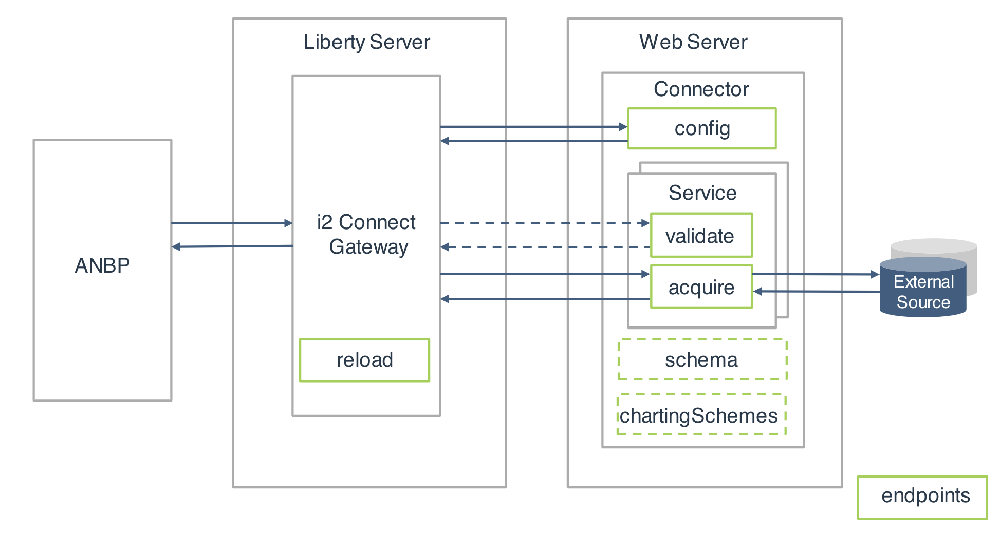

# Welcome

Welcome to the GitHub home page for the i2 Connect example. The i2 Connect
example demonstrates how to create and configure an i2 connector that
retrieves data from an external source.

In a deployment of i2 Analyze that uses the i2 Connect gateway, a _connector_
transforms data from an external source into entity and link records that
conform to your i2 Analyze schema, to be viewed and analyzed in Analyst's
Notebook Premium.

When you implement a connector, you develop _services_ that allow analysts to
perform parameterized searches to find records based on conditions and
seeded searches to find records that are connected to other records.

By creating an example connector, you will implement all of the endpoints identified in
the diagram to create and configure a connector that retrieves data from an
external source. The connector is developed to provide services that can be used
to search for all the data in the external source or a subset of the data that
satisfies a set of specified conditions. The connector also performs server-side
validation to prohibit invalid requests.

- [Read the documentation](./docs/index.md)
- [Download the Connect zip file](https://github.com/IBM-i2/Analyze-Connect/releases)

You can raise issues and questions about the IBM i2 Connect example [HERE](https://github.com/IBM-i2/Analyze-Connect/issues).