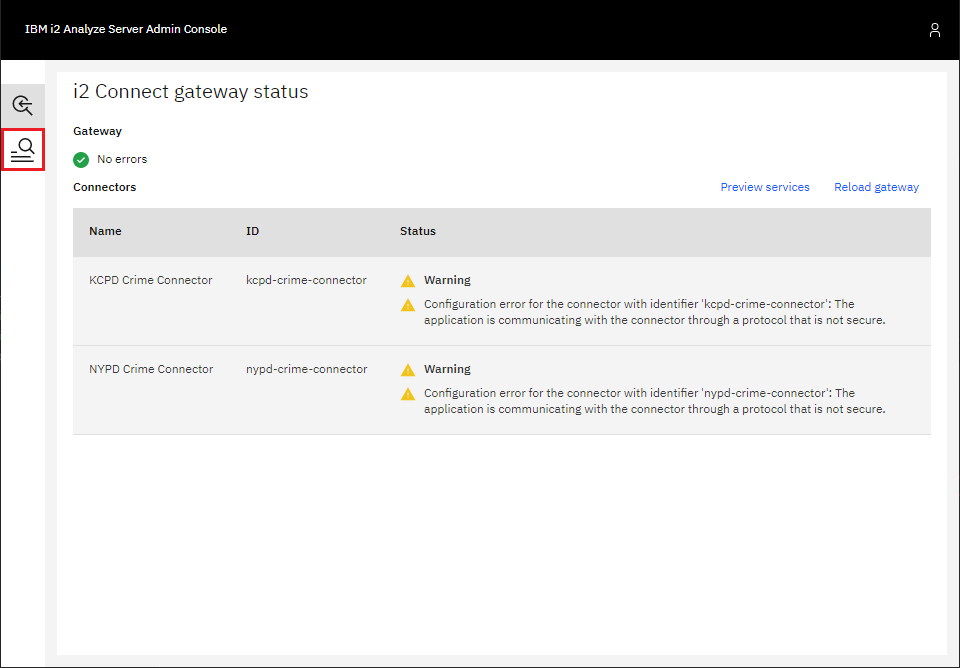
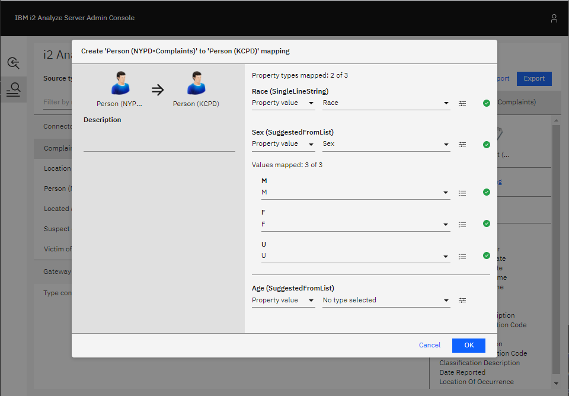
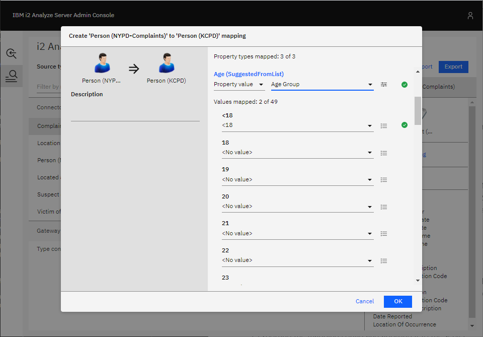
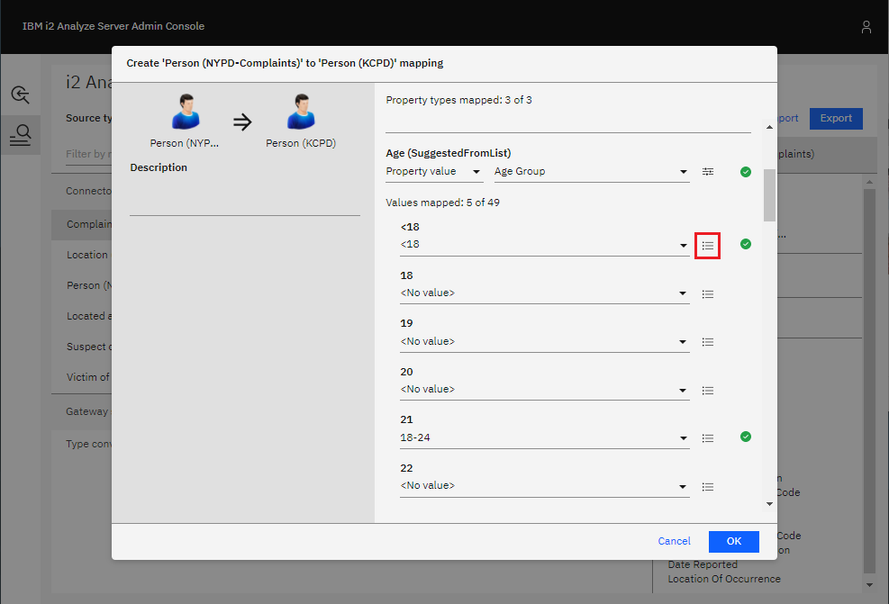

# Configuring item type mappings

To show the process of mapping one type to another, you can map the Person
type in the `NYPD-Complaints` schema to the Person type in the `KCPD-Crime`
schema.

Examples of both Person types are shown below. Both Person types contain
the same property types: age, sex, and race. The main difference between the two
is that the NYPD Person type models age in ranges, and the KCPD Person type
holds specific values for ages.

<center>

NYPD Person | KCPD Person
:---: | :---:
 | 

</center>

## Accessing the mapping configuration interface

In a web browser, go to `<i2-Analyze-URL>/admin`, where `<i2-Analyze-URL>` is
the URL used to access your i2 Analyze deployment. For example, 
`http://localhost:9082/opaldaod/admin`.

Log in using credentials with `i2:Administrator` command access control
permission. For more information about ensuring you have the correct
permissions, see [Admin Interface](./admin-cac.md).

The gateway configuration summary is shown as below. For the mapping
configuration interface, click the button in the sidebar that is highlighted in red.



A list of all the item types across all gateway and connector
schemas is displayed, with some information about any item type mappings that
have been defined. In this example, no mappings are configured yet.


## Defining a mapping

### 1. Select the source type

In the list of item types, select the one to map. For this example,
the Person type from the NYPD-Complaints connector schema is selected. Then,
click on either the arrow shown on the list item, or **Create Mapping** in the
pane on the right.

### 2. Select the target type

A dialog box that contains a list of item types to which your
selected source type can be mapped is displayed. Choose an appropriate item
type. For this example, the Person type from the KCPD-Complaints gateway schema
is selected. After you select the target type, click **Create mapping**.


### 3. Define the property mappings

At this stage, define how the property values of the source type are
mapped to property values of the target type.



The properties shown in the dialog are the properties of the target type. For
each target property, you can do one of the following:

- **Map a property from the source item type to the target property.** When a
  record of the source item type is mapped to a record of the target item
  type, the target property is populated with the value of the source
  property. The logical type of the source property type must be compatible with
  the logical type of the target property type.
- **Map to a fixed value.** When a record of the source item type is mapped to a
  record of the target item type, the target property is populated with the
  fixed value provided in the mapping configuration.
- **Leave the property unmapped.** When a record of the source item type is
  mapped to a record of the target type, the target property is not
  populated. Target property types that are mandatory cannot be left unmapped.

#### Automatically mapped properties

A property type of the source item type is automatically mapped to a
property type in the target item type if they have the same:

- display name
- logical type

If the two properties have the logical type SELECTED_FROM or
SUGGESTED_FROM, any possible values of the source property that are also
present in the target property are mapped automatically to those values in
the target property.

You can see in the example that this has applied to the race and sex property
types. These automatically-generated mappings can still be edited if they do not
meet your requirements.

#### Map a property from the source item type

To map a property from the source item type to a target property:

1. Select **Property value** in the left-most dropdown menu below the target
   property name.
2. Then, choose a property from the source item type in the right-most dropdown.
   Only compatible properties from the source type are shown.

For all logical types, except SELECTED_FROM and SUGGESTED_FROM, this is all that
is required. For properties with a logical type of SELECTED_FROM or
SUGGESTED_FROM, you might also need to specify how the values are mapped.



This is the case in the example when choosing to map the age group property
from the NYPD schema to the age property in the KCPD schema. The source age
group property is a SUGGESTED_FROM of age groups; the target age property
is a SUGGESTED_FROM of specific ages.

The values shown in the dialog box are the possible values for the target age
property. For each target property, you can do one of the following:

- **Map a value from the source property to it.** Select which value of
  the source property to be mapped to the target value. Each
  value of the source property cannot be mapped to more than one value of the
  target value.
- **Leave it unmapped.** Select **\<No value\>** in the dropdown. Then, no
  value of the source property type is mapped to this value of the target
  property type.

Similar to how property types are automatically mapped, values of
SELECTED_FROM and SUGGESTED_FROM properties are automatically mapped
if the value of the target property type is the same as a value of the source
property type. This is the case for the "<18" and "65+" values.

For the other target values, you either have to choose an age group from the
source value to effectively collapse to a single age, or you can leave them
unmapped.

#### Map to a fixed value

To map a fixed value:

- Select **Fixed value** in the left-most dropdown menu below the target
  property name.
- Enter a fixed value to use in the left-most field.

#### Choosing the value for reverse conversions

If a connector accepts a particular item type for the seeds of a seeded search
and that item type is the source type of a mapping, then users are able to
use records of the mapping's target type as seeds when using the service.

However, when i2 Analyze sends seed records to the connector, it must apply the
mapping in reverse. This is because the connector is expecting seeds of the
source item type and is unaware of any mapping configured on the i2 Analyze
server.

For mappings of properties where the logical type of both the source property
and the target property are the same and are not SELECTED_FROM or
SUGGESTED_FROM, the reverse conversion is done by simply populating the source
property with the value of the target property.

When mapping between SELECTED_FROM and SUGGESTED_FROM properties, you can choose
how i2 Analyze maps the values of the target property to the possible values of
the source property. To do this:

1. Click the button to the right of the dropdown menu for a target value that
   has been mapped

   

2. From the dropdown shown, select which one of the source values you have
   mapped to the target value i2 Analyze should use when applying the mapping in
   reverse for seeded searches.
3. Confirm your choice by clicking **OK**.

### 4. Add a description

After you define the property mappings, you can add a description of the
item type mapping.

### 5. Confirm the Mapping

Click **OK** in the bottom-right of the dialog to save your item type mapping.
The list of item types shows how the source type has
been mapped. Note, at this point your mapping has not yet been deployed on
the server.


You are able to edit the mapping by clicking **Edit mapping** in the right-hand
pane, or delete the mapping by clicking **Delete mapping**.

## Applying the mappings for testing

After you define the item type mappings, you can test the i2 Connect services
available on your i2 Analyze deployment to see how they would look if you
were to apply the mappings you have configured. To do this:

1. Click **Apply**. This applies the current mapping configuration for testing.
2. Click **Preview services**. This opens the **External Searches** dialog as it
   would appear in Analyst's Notebook Premium. You can use the services defined
   and see the results as they would appear if the mapping that has been applied
   for testing was deployed on the server.


To revert the mapping configuration back to the current
deployed configuration on the server, you can also use the **Restore** button
that is next to **Apply**.

## Applying the mapping to the server

After you preview the i2 Connect services using your new mappings and you
are happy with them, you can deploy your mapping configuration to the i2 Analyze
server. To do this:

1. In the mapping configuration interface, click **Export** in the top right
   corner. This downloads a `mapping-configuration.json` file.
2. Move the `mapping-configuration.json` file into the
   `toolkit/configuration/fragments/common/WEB-INF/classes` directory of your
   configuration.
3. Redeploy the i2 Analyze server:

   ```shell
   setup -t stopLiberty
   setup -t deployLiberty
   setup -t startLiberty
   ```
