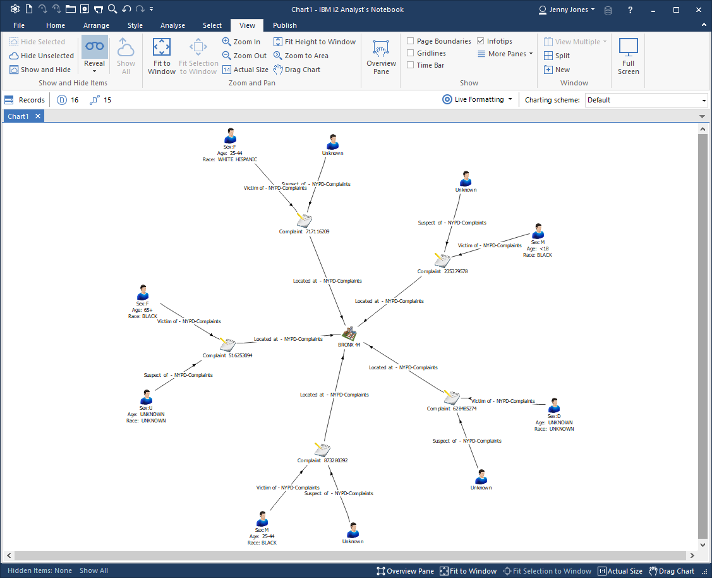
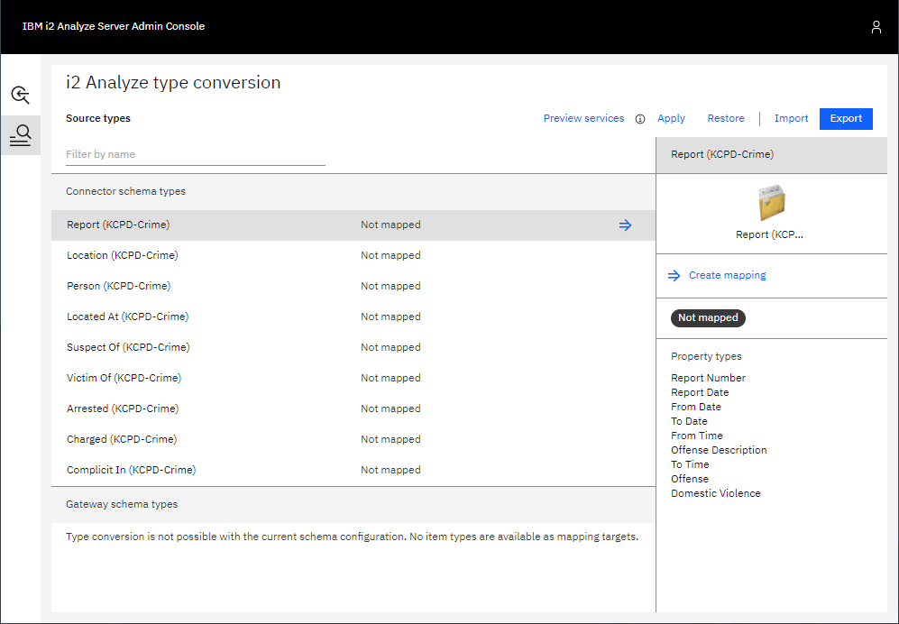
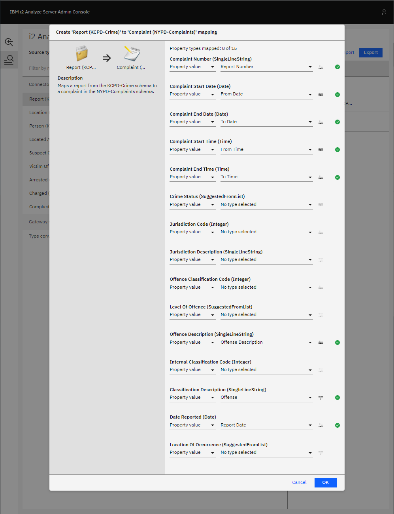
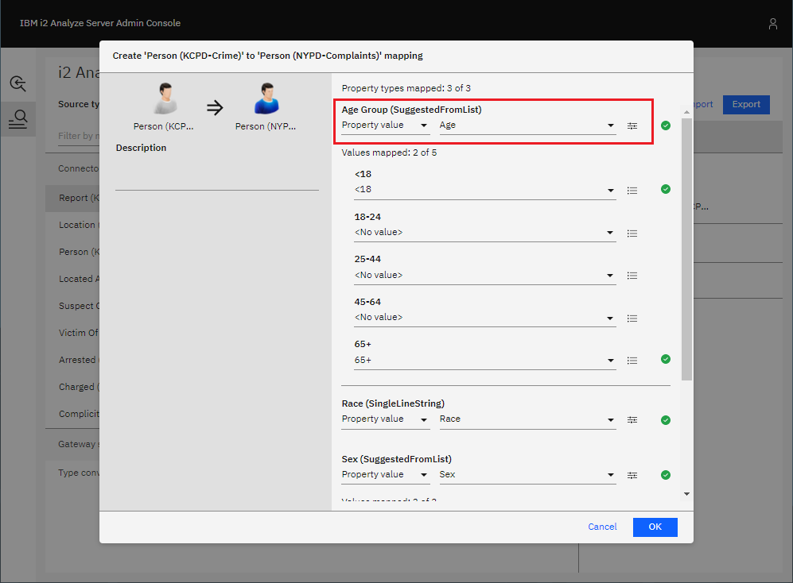
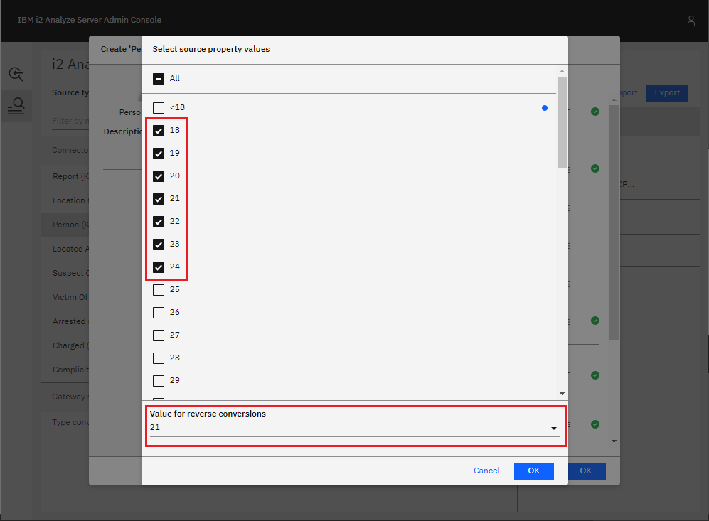
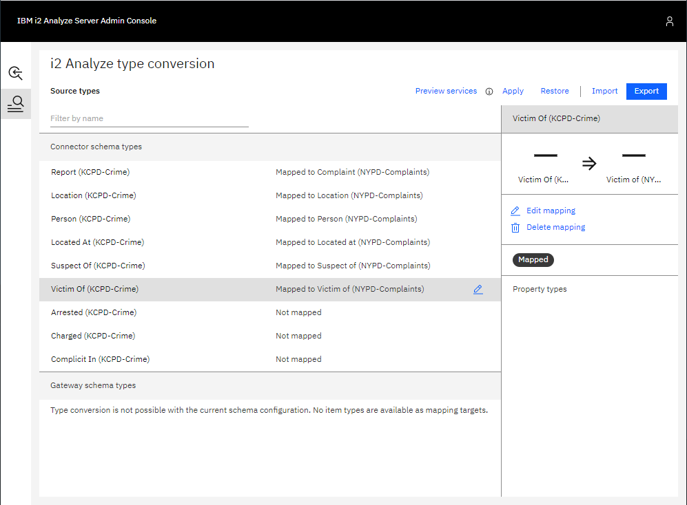
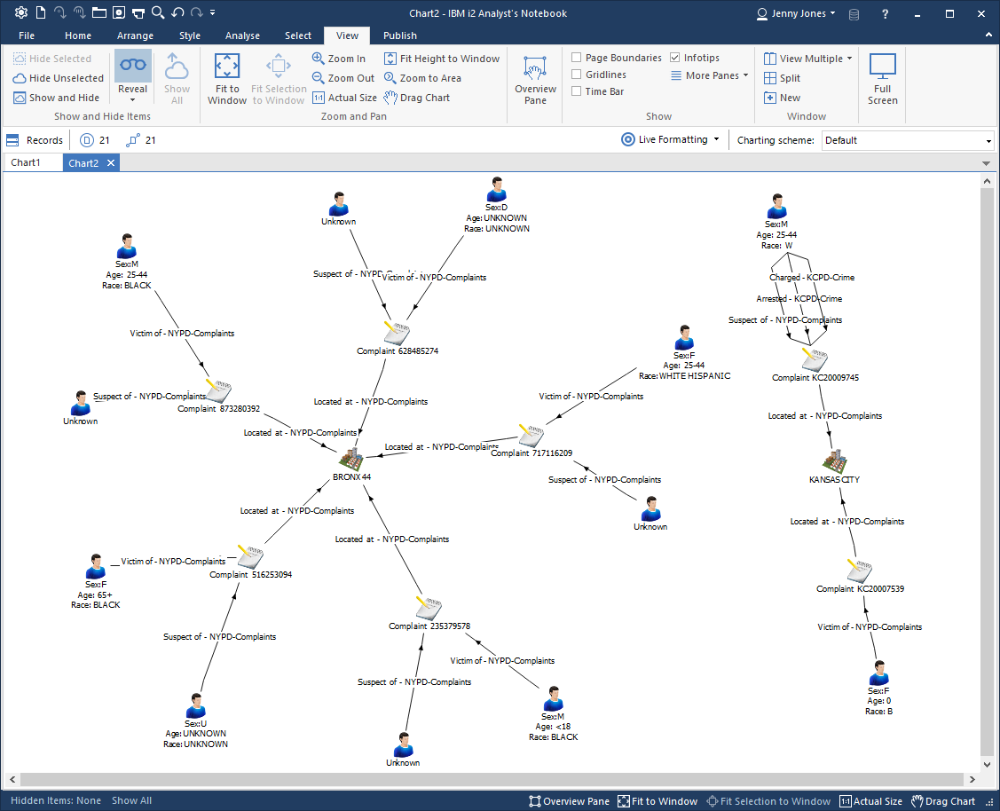

# Adding a connector with a connector schema to an existing deployment

In this example scenario, a new connector with its own connector schema will be
added to an i2 Analyze deployment with an existing gateway schema. Item types in
the connector schema will be mapped to item types in the gateway schema where
possible.

## Setting up the scenario

To follow this scenario, start by [deploying i2 Analyze with the example NYPD
connector](connector-nypd.md) configured to use a gateway schema.

You should now be able to connect to the i2 Analyze server in Analyst's Notebook
Premium and use the services provided by the NYPD connector. For example, you
might use the "Get All" service and copy some of the results to a chart.

## Adding the new connector

Now, [add the example KCPD connector to the deployment](connector-kcpd.md),
ensuring it is configured to use its own connector schema.

You should now also be able to use the services provided by the KCPD connector
and copy some results to the chart.

But you can see that the gateway schema used by the NYPD connector and the
connector schema used by the KCPD connector have different item types to model
the same real-world object. This is evident by the different icons used and, in
the image shown, you can see pairs of the similar types highlighted in the same
color.

 | 
---|---

By looking at all the available item types, you can see that both schemas have
their own:

- Person entity type
- Location entity type
- Complaint/Report entity type (these have different names, but they model the
  same concept)
- Located At link type
- Suspect Of link type
- Victim Of link type

This duplication can be removed using item type mappings.

## Configuring item type mappings

Go to the item type mapping configuration in the i2 Analyze Server Admin Console
in a web browser to see the list of item types that can be mapped. You should
see the list of all item types in the KCPD-Crime schema, and that none of them
have been mapped.

Where appropriate, KCPD-Crime item types can be mapped to similar item types in
the pre-existing NYPD-Complaints gateway schema.

### Reports and Complaints

The Report entity type in the KCPD-Crime schema can be mapped to the Complaint
entity type in the NYPD-Complaints schema.

1. Select the **Report (KCPD-Crime)** item type in the list, then click **Create
   mapping** in the right-hand pane. This shows the list of item types to which
   the Report item type can be mapped.
2. Select the **Complaint** item type from the NYPD-Complaints schema, then
   click **Create mapping**. You will then see all the properties of the
   Complaint type in the NYPD-Complaints schema, with options available to
   choose how they should be populated when mapping from a KCPD-Crime Report
   record.

   

3. In the example below, the properties of the Report (KCPD-Crime) type are
   mapped to the properties of the Complaint (NYPD-Complaints) according to the
   following table.

   Report (KCPD-Crime) | Complaint (NYPD-Complaints)
   --------------------|----------------------------
   Report Number       | Complaint Number
   From Date           | Complaint Start Date
   To Date             | Complaint End Date
   From Time           | Complaint Start Time
   To Time             | Complaint End Time
   Offense Description | Offence Description
   Offense             | Classification Description
   Report Date         | Date Reported

   

   There is no comparable property in the Report (KCPD-Crime) type for the
   Complaint (NYPD-Complaints) properties:

   - Crime Status
   - Jurisdiction Code
   - Jurisdiction Description
   - Offence Classification Code
   - Level Of Offence
   - Internal Classification Code
   - Location Of Occurrence

   So these are left unmapped. This means that they will not be populated for
   the Complaints records that are mapped from Report records.

4. Once you are satisfied with all the property mappings, confirm the mapping by
   clicking **OK**. You should see in the list of types that Report (KCPD-Crime)
   has been mapped to Complaint (NYPD-Complaints).

   

### Locations

Following the same process, the Location type from the KCPD-Crime schema can be
mapped to the Location type in the NYPD-Complaints schema.

The Coordinates property of Location (KCPD-Crime) is automatically mapped to the
Coordinates property of Location (NYPD-Complaints). Below is an example
configuration you could use.

You can see that the Borough Name property of mapped Locations will be populated by
the value of the City property from KCPD-Crime Location records. These
properties aren't an exact match with one another, but this can be used to make
it clear when Locations are in Kansas City, instead of New York City, in case
Coordinates are not provided.

You can go further and ensure the Borough Name property is always populated in
mapped Locations by setting a default value, which will be used if the source
KCPD-Crime Location record does not contain a value for the City property. To do
this:

1. Click the button highlighted to the right of the Borough Name configuration
   shown below.

   

2. Enter a default value to use for the Borough Name property if a source
   KCPD-Crime Location record has no City value, e.g. "Kansas City".

3. Click **OK**.

The mapping of Address to Premises Description does not seem like a perfect
match either. But, the Address of a Location might be too important not to have
and the Premises Description is a suitable target property in which to store it.

Again, once you are happy with the mapping configuration for Location records,
click **OK** to confirm the mapping.

### People

Following the same process, you can map the Person (KCPD-Crime) type to the
Person (NYPD-Complaints type).

The Race and Sex property mappings will be automatically-generated, so the only
property left is Age. Choose to map the value of the Age property from the
Person (KCPD-Crime) type as shown below.

The Age property of the source type and the target type are both SUGGESTED_FROM
properties, but they have different suggested values. The source property, from
the KCPD-Crime schema, has suggested values: `<18`, `19`, `20`, `21`, ..., `64`,
and `65+`; whereas the target property, from the NYPD-Complaints schema, has
suggested values: `<18`, `18-24`, `25-44`, `45-64`, and `65+`.

Notice how the `<18` and `65+` values are automatically mapped to one another.
For the remaining target values (`18-24`, `25-44`, and `45-64`), you must choose
which source values should map to them.

You have the option to select a single value of the source property from the
dropdown, but that wouldn't make much sense. For example, the source
property values `18`, `19`, `20`, `21`, `22`, `23`, and `24` should *all* map to
the `18-24` target value. To do this, click the button to the right of the
dropdown menu beneath *18-24* highlighted below.

Then, select all the appropriate values as shown below and select a source
value to use when the conversion is applied in reverse during any seeded
searches.

### Located At

The Located At (KCPD-Crime) link type can be mapped to the Located At
(NYPD-Complaints) link type by following the same process:

1. Select **Located At (KCPD-Crime)** in the list of types, then click **Create
   mapping** in the right-hand pane.
2. Select **Located At** from the NYPD-Complaints link types, then click
   **Create mapping**.
3. There are no properties to map, so just add a description if you wish.
4. Confirm the mapping by clicking **OK**.

### Suspect Of

Map Suspect Of (KCPD-Crime) to Suspect Of (NYPD-Complaints) in the same way.

### Victim Of

Map Victim Of (KCPD-Crime) to Victim Of (NYPD-Complaints) in the same way.

## Testing the item type mappings

Once you have defined the item type mappings, you should see the updated list of
types like the example shown below.

The Arrested, Charged, and Complicit In links are left unmapped, because there
are no suitable target link types in the existing NYPD-Complaints schema. i2
Analyze will recognize that their end types have been mapped and allow the
NYPD-Complaints schema's Person and Complaint types to be connected by these
links.

To test the item type mappings by previewing the external searches provided by
the NYPD and KCPD connectors:

1. Click **Apply** in the top-right. This applies the mappings to the test
   environment that is available only through the Admin Console. It does not
   apply the mappings to the live server.
2. Click **Preview services** to open a preview of how the services would behave
   with the mappings you have configured. Notice how the KCPD Connector's Get
   All service now returns item types from the NYPD-Complaints schema.
3. Go back and make any changes to the mappings, repeating steps 1 and 2 until
   you are satisfied with the configuration.

## Applying the item type mappings to the i2 Analyze server
To apply the mapping configuration you have created on the i2 Analyze server for
all users, see
[Applying the mapping configuration to the i2 Analyze server](item-type-mapping-config.md#Applying-the-mapping-to-the-server).

## The result
<!-- Refer back to the duplication mentioned previously, showing how it has been
resolved. -->
In Analyst's Notebook Premium, use some of the services provided by the two
connectors and copy some results from each connector to your chart. Notice how
there are now no duplicate item types.

For example, compare the chart below to the one at the very beginning of this
walkthrough. You can see that all of the records have types from the
NYPD-Complaints schema, except for the unmapped Arrested and Charged links in
the top-right corner.

