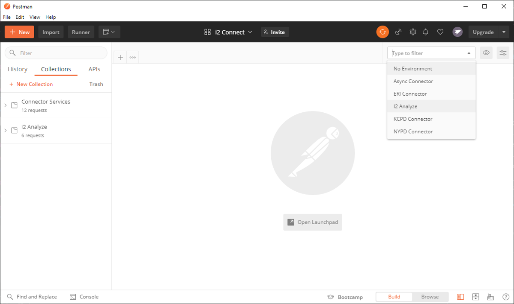
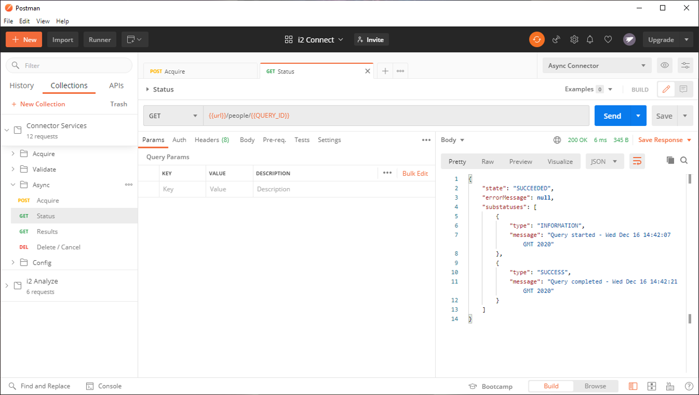

# Postman

You can use Postman collections to test the endpoints of i2 Analyze and your connector.

## Prerequisites

- Install the latest version of Postman;
- Import the Postman environments from [here](../postman/environments);
- Import the Postman collections from [here](../postman/collections);

To import the environments and collections:

1. Click **Import**, or click **File -> Import**
2. In the **Import Folder** tab, click **Choose Folders**
3. Select the `postman` directory that you downloaded from this repository.

The Postman collections are displayed in the left pane and a populated dropdown
list of environments near the top right of the window.

## Testing i2 Analyze

To make sure that i2 Analyze is configured correctly, authenticate a user and test the API.

### Authentication

1. Click on the environment dropdown menu at the top-right bar and select the `i2 Analyze` environment.
2. Open the `i2 Analyze` collection.
3. Open the `Authentication` folder.
4. Run the `Form Based Login` request.

This authenticates your Jenny user, and generates the session token to permit subsequent API requests.

### API

After generating the token, test that you can use the i2 Analyze endpoints.

#### Get all valid timezones

1. In the `i2 Analyze` collection, open the `Core` folder.
2. Run the `Timezones` request.

You should see that i2 Analyze returns all valid timezones.

#### Get all connectors

1. In the `i2 Analyze` collection, open the `Connectors` folder.
2. Run the `Connectors` request.

You should see that i2 Analyze returns a JSON response containing a list of all configured connectors.

#### Reload connectors configuration

1. In the `i2 Analyze` collection, open the `Gateway` folder.
2. Run the `Reload` request.

You should see that i2 Analyze returns its connectors configuration.

## Testing a connector

Before you test your connector, ensure that both i2 Analyze and your connector are running. In this example, the NYPD connector is tested. For more information, see [Setting up and running the NYPD connector](./connector-nypd.md).

1. From the environment dropdown menu, select the `NYPD Connector` environment.
2. Open the `Connector Services` collection.

### Config and schema endpoints

1. In the `Connector Services` collection, open the `Config` folder.
2. Run the `Config` request.

The response provided should be the full contents of the connector's `config.json`.

The `Schema` and `Charting Schemes` requests should echo the contents of your connector schema and charting schemes XML files respectively.

### Acquire endpoints

The `Acquire` folder contains requests that respond with entities and links according to how their respective endpoints were implemented.

Using the NYPD connector example:

#### All

The `All` request synchronously returns all entities and links from the NYPD dataset as a JSON response.

#### Search

The `Search` request is a [parameterized search](./parameterised-search.md) accepts a JSON payload of specified conditions which filter the results returned.

The values of each condition can be changed to imitate user input from the client for a condition field.

#### Find Like This

The `Find Like This` request is a [seeded search](./seeded-search.md) that accepts a JSON payload of a single seed entity with a property that is used to filter the JSON response by matching against entities with a similar property.

#### Expand

The `Expand` request is a [seeded search](./seeded-search.md) that accepts a JSON payload of a single seed entity used as a starting point to find other entities connected to it and the links that connect them. These entities and links are returned in the response in JSON format.

### Validate

The `Validate` folder contains a single `Search` request that [performs server-side validation](./validation.md) on the payload of specified conditions to ensure input values are in the correct format.

### Async

The `Async` folder contains requests for the asynchronous service. These requests only function as expected on our Async connector. For more information, see [setting up and running the Async connector](./connector-async.md)

#### Acquire

The `Acquire` request triggers an asynchronous query and returns a `queryId`. Using Postman tests (post-request logic), this `queryId` is automatically stored as an environment variable (`QUERY_ID`) to facilitate subsequent async requests.

The request accepts a payload of parameters for simulating the asynchronous request; configuring the duration of time before succeeding and optionally mocking a failure.

#### Status

Using the `QUERY_ID` retrieved from the previous request, the `Status` retrieves the current status and additional information of the triggered asynchronous query as a JSON response.

#### Results

Using the same `QUERY_ID` from the async acquire, the `Results` retrieves the JSON response of entities and links from the asynchronous query as you would expect from a synchronous request.

This request only works as expected after the status of the query is `SUCCEEDED`.

#### Delete / Cancel

Using the `QUERY_ID`, the `Delete / Cancel` request deletes an asynchronous query if its state is `SUCCEEDED` or `FAILED`. It cancels the running job if it was `STARTED`, causing it to be `FAILED`.