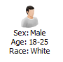
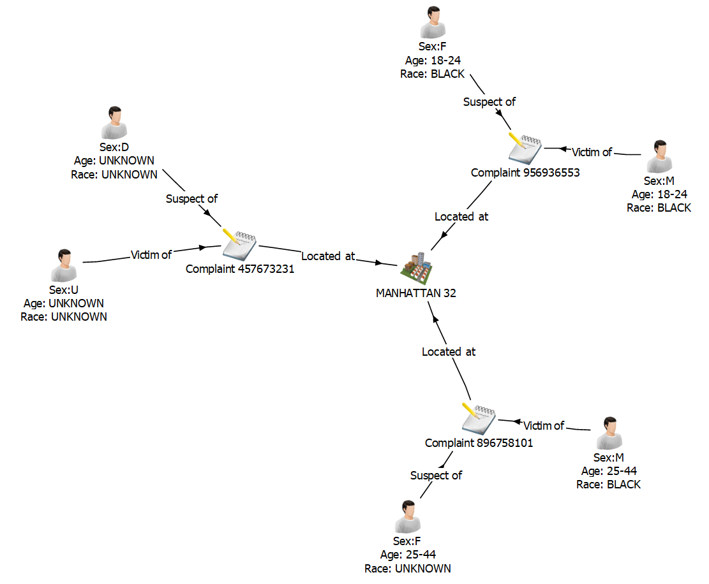
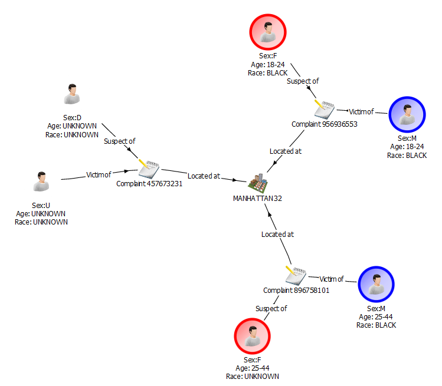

# Designing the i2 Analyze schema
The schema is at the core of any i2 Analyze deployment. It defines the types of
entities, links, and properties that users can view and analyze in Analyst's
Notebook Premium. This section guides you through the process of developing a
schema that aligns with the data the connector will retrieve.

The process of developing a schema is iterative. Schema design requires fine
tuning, especially if you are unfamiliar with the data set that you are creating
the schema for. After you deploy i2 Analyze, you will be able to experiment with
and test the schema you create. You can refer back to this document to repeat
the process until you have a schema that you believe represents the NYPD 
Complaint Dataset.

If you already understand the schema development process, you can use the
example schema from this repository.

## Prerequisites
Before you start, ensure that you have installed Analyst's Notebook Premium with
the i2 Analyze Schema Designer.

## The i2 Analyze schema
There are three integral components of an i2 Analyze schema:

- **Entity types**. These represent real-world concepts such as person,
  location, bank account, or event ("meeting", for example).

- **Link types**. A link type describes a relationship between two entity types,
  such as a person's ownership of a vehicle or a transaction between two bank
  accounts. Link types can specify exactly which entity types can appear at their
  ends, or they can represent a general association between entities of any types.
  A link between entities on a chart is represented by a line between them, which
  will be an arrow if the link is directed.

- **Property types**. Entities and links have properties, which store information
  about the object, event, or relationship. For example, a person
  might have a name, date of birth, and eye color; while a meeting might have a
  date, a time, and a duration. The property types of an entity or link type
  define exactly what properties the records of that type can have.

## Getting to know the data
The data that your connector will retrieve comes from the
[NYPD Complaint Dataset](https://data.cityofnewyork.us/Public-Safety/NYPD-Complaint-Data-Current-Year-To-Date-/5uac-w243).
Before you build your schema, you should explore the data and decide how to
model it as entities, links, and properties. You can also consult the
[data API](https://dev.socrata.com/foundry/data.cityofnewyork.us/5uac-w243) and
look at the [raw data](https://data.cityofnewyork.us/resource/7x9x-zpz6.json) if
you want to.

## Creating the schema
Open i2 Analyze Schema Designer. From the **File** menu, click **New Schema**.

### Adding entity types
You need to create some entity types that can represent different objects.
These types will relate to the supplied NYPD Complaint Dataset, and you can
decide what they will be. One example of an entity type used in the sample
schema is a `Complaint`. You can follow the instructions below to simulate
creating the example schema with this entity type, or you can create your own
types.
1. From the **Insert** menu, click **New Entity Type**.
2. Enter a name and a description for the entity type. (For example, **Name:**
   Complaint, **Description:** "A complaint regarding an incident that occurred
   between some individuals".)
3. Select an icon to represent entities of this type in Analyst's Notebook
   Premium. (For example, a notepad.)

You can create any entity types you like, provided that they align with the
data. For example, you could have entity types to represent people and
locations. Look at the example schema for inspiration if you need to.

#### Adding property types to entity types
For the entity types that you created, decide which fields in the data provide
information that can be stored in properties. To continue with the `Complaint`
example, some property types that might be suitable include:
- Complaint Number
- Complaint Start Date
- Complaint End Date
- Level of Offense
- Offense Description
- Latitude
- Longitude

These property types are valuable because they allow for additional analysis to
occur in Analyst's Notebook Premium. They provide the opportunity to conduct
live formatting on the data, as well as to create different charting schemes for
when data needs to be displayed in a different fashion. This is explained in
more detail in _Creating a charting scheme_, below.

To add a property type to an entity type:
1. Select the entity type in the navigation tree.
2. From the **Insert** menu, click **New Property Type**.
3. Enter a name and a description for the new property type. (For example,
   **Name:** Complaint Number, **Description:** "Persistent ID for each complaint".)
4. Assign a logical type that describes the type of data that properties of
   this type will contain. (For example, **Integer**.)
5. Select the **Is Mandatory** checkbox if you want to enforce that all
   entities of this type have a property of this type.

### Adding link types
Decide how the entity types you have created can be related. An example of
a link type in the supplied schema is Located At. You can follow the
instructions below to simulate creating the example schema with this link type,
or you can create your own link types:
1. From the **Insert** menu, click **New Link Type**.
2. Enter a name and a description for the link type. (For example, **Name:**
   Located At, **Description:** "Where the incident was located".)
3. Links often make sense only between certain entity types. To choose which
   entities can be connected by a link of this type, open the **Link Ends** tab
   and select the appropriate **From End Types** and **To End Types**. (For
   example, **From End:** Complaint, **To End:** Location.)

Define as many link types as you like, ensuring that they align with the data.
For example, a person might be linked to a complaint if they are listed as the
victim in the complaint. You might therefore have a `Victim In` link type that
connects Person entities to Complaint entities. Similarly, you might define a
a `Suspect In` link type.

#### Adding property types to link types
For the link types that you have created, decide if there are fields in the
data set that can provide properties for them. The example schema contains no
links with properties, and you can complete the demonstration without them, but
they might be useful for the connectors that you make after following this
guide. To add a property type to a link type:
1. Select the link type in the navigation tree.
2. From the **Insert** menu, click **New Property Type**.
3. Enter a name and a description for the new property type.
4. Assign a logical type that describes the type of data that properties of
   this type will contain. For example, **Single Line String** or **Integer**.
5. Select the **Is Mandatory** checkbox if you want to enforce that all
   links have a property of this type.

### Creating a charting scheme
When you have defined all the entity, link, and property types you want to
model, you must create a charting scheme to determine how items that contain
your entity and link records appear in Analyst's Notebook Premium. For example,
the charting scheme determines how labels on the chart are generated from
properties of entities and links.

To create a charting scheme:
1. From the **File** menu, click **Edit Charting Schemes**.
2. Expand the first charting scheme in the left panel to reveal
   **Entity Types** and **Link Types**.
3. Expand **Entity Types** and **Link Types** to reveal the entity and link
   types that you created earlier.
4. Right-click **Properties** and select **Insert Chart Item Property Type"**.
   From the drop-down, select **Label**.
5. In the **Label** tab, set the text to be displayed with entities of this
   type in Analyst's Notebook Premium to distinguish them on the chart.

   - You can use the values of properties assigned to a record to construct
     your label. To use a property value, click the downward arrow on the
     **Insert** button and select the property type of your choice. In the
     example charting scheme, the Complaint Number is used in the label of
     Complaint entities.

   - You can prefix the value of a property with a space, a newline, or some
     custom text. The prefix can clarify what data is represented in the label.
     For example, a Complaint Number might be prefixed with the text
     "Complaint ". This is displayed in Schema Designer as follows:

     

     A Complaint with the Complaint Number 667574574 will then be displayed in
     Analyst's Notebook Premium like this:

     

      

     

     You can also add a suffix in the same way, which can be useful if you use
     multiple property values in the label. For example, you might display
     values on separate lines, or with spaces between them. For example, Person
     entities in the example are shown as follows:

     

     

     

   - You can also set a default value to use when propert values are not set.
     In this case, the default value is "NO PROPERTIES".

   This range of options allows you to customize your charting scheme in a way
   that best represents your data. To combine multiple properties into a single
   label, follow the above process again.

6. You can add more charting schemes to visualize the data in different ways.
   The supplied example schema contains two charting schemes - one with labels
   (detailed version) and one without labels (simplified version). To create
   further charting schemes, repeat the above instructions with different (or
   no) labels.

   A group of entities and links with a detailed charting scheme might look like
   this:

   

   This charting scheme provides a substantial amount of information to the
   analyst, allowing them to see details of their entities and links at a
   glance. However, there might be times when this much information is
   overwhelming, especially in a chart with lots of records. For such cases, you
   might use a simpler charting scheme that just gives an overview of data in
   the records. A group of entities and links with a simplified charting scheme
   might look like this:

   
7. When you have finished making your changes, click **OK** to close the
   charting scheme editor.

See the [Knowledge Center](https://www.ibm.com/support/knowledgecenter/en/SS3J58_9.2.0/com.ibm.i2.iap.schemadesigner.doc/creating_a_charting_scheme.html)
for information about adding property types that are not used in the example schema.

#### Link summarizations
Sometimes, multiple links exist between the same two entities on a chart in
Analyst's Notebook Premium. You can use the charting scheme to choose how to
represent these links. The different link summarizations that you can use are:

| Link Option          | Description                                        |
|----------------------|----------------------------------------------------|
| **Single Link**      | All links of the selected type between the same two entities are combined into a single link. This option is useful if you are producing a summary chart and do not want to show all the detail of the data between entities. |
| **Directed**         | All links of the selected type in the same direction between the same two entities are combined. This option is useful if you are charting information such as telephone calls or transactions. |
| **Multiple**         | Each link of the selected type between the same two entities is charted separately. This option is useful if you want to show all the detail. If there are many links, you might make the chart cluttered or hard to read. |
| **Flow**             | All links of the selected type between the same two entities are combined into a single, directed link. The direction (or flow) is determined from a property that you specify. For example, if there are several financial transactions between two bank accounts, this option is useful to determine the direction that the aggregate amount of the money is flowing. |

The example schema uses link multiplicity (Multiple) to show all the data
flowing to and from entities. If you want to change this setting, this is the
time to do so! You are likely to use other settings in your own connectors.

### Live Formatting in Analyst's Notebook Premium
Live formatting in Analyst's Notebook Premium is a type of Conitional Formatting that changes the 
appearance of chart items, by applying conditional formatting specifications in real time. This 
allows analysts to format their charts to their own specifications. The default appearance of 
chart items is defined by your schema, but Live Formatting extends this to provide for filtering 
and quick, real time insight. An example of this functionality in action with the example schema 
is with the Sex property of the Person entity. Live Formatting allows for quick, visual confirmation
of whether a Person is a Male or a Female (blue for Male, red for Female). This example can be seen 
as follows.

If you wish to know more about Live Formatting, including information regarding its setup, how to define
a specification, and formatting system messages, you can visit the [Knowledge Centre](https://www.ibm.com/support/knowledgecenter/SSXVXZ_latest/com.ibm.i2.anb.doc/about_live_format.html).
### Saving the schema
1. From the **File** menu, click **Save Schema**.
2. Choose a location to save your schema, then click **Save**.

The schema and charting schemes will both be saved in your chose location as XML
files.

Now that you have defined your schema, you need to
[deploy i2 Analyze](./deploy-i2-analyze.md).
