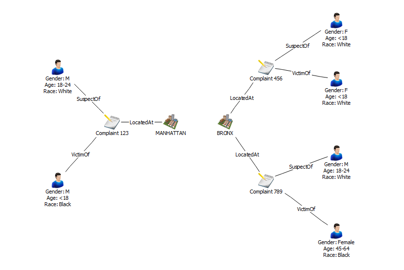

# i2 Connect SPI examples
You can use the following example `DaodRequest`s and `ConnectorResponse`s to help
understand how parameterised and seeded search services work.

## Example data
Throughout, assume you are querying the following set of entities and links.



In the example schema, there are the following Type IDs for each of the 
entity, link, and property types used:

 Item                | ID
---------------------|---------
 Complaint           | ET1
 \- Complaint Number | PT1
 Location            | ET2
 \- Borough Name     | PT16
 Person              | ET3
 \- Age Group        | PT26
 \- Race             | PT27
 \- Gender           | PT28
 Located At          | LT1
 Suspect Of          | LT2
 Victim Of           | LT3

This can be represented as a set of entities and links in JSON as follows.
```json
{
  "entities": [
    {
      "typeId": "ET1",
      "id": "123",
      "version": 1,
      "properties": {
        "PT1": 123,
      }
    },
    {
      "typeId": "ET2",
      "id": "111",
      "version": 1,
      "properties": {
        "PT16": "MANHATTAN"
      }
    },
    {
      "typeId": "ET3",
      "id": "abc",
      "version": 1,
      "properties": {
        "PT28": "M",
        "PT26": "18-24",
        "PT27": "White"
      }
    },
    {
      "typeId": "ET3",
      "id": "def",
      "version": 1,
      "properties": {
        "PT28": "M",
        "PT26": "<18",
        "PT27": "Black"
      }
    },
    {
      "typeId": "ET1",
      "id": "456",
      "version": 1,
      "properties": {
        "PT1": 456,
      }
    },
    {
      "typeId": "ET3",
      "id": "ghi",
      "version": 1,
      "properties": {
        "PT28": "F",
        "PT26": "<18",
        "PT27": "White"
      }
    },
    {
      "typeId": "ET3",
      "id": "jkl",
      "version": 1,
      "properties": {
        "PT28": "F",
        "PT26": "<18",
        "PT27": "White"
      }
    },
    {
      "typeId": "ET1",
      "id": "789",
      "version": 1,
      "properties": {
        "PT1": 789,
      }
    },
    {
      "typeId": "ET2",
      "id": "222",
      "version": 1,
      "properties": {
        "PT16": "BRONX"
      }
    },
    {
      "typeId": "ET3",
      "id": "mno",
      "version": 1,
      "properties": {
        "PT28": "M",
        "PT26": "18-24",
        "PT27": "White"
      }
    },
    {
      "typeId": "ET3",
      "id": "pqr",
      "version": 1,
      "properties": {
        "PT28": "F",
        "PT26": "45-64",
        "PT27": "Black"
      }
    }
  ],
  "links": [
    {
      "typeId": "LT1",
      "id": "aahsgf",
      "version": 1,
      "fromEndId": "123",
      "toEndId": "111",
      "linkDirection": "WITH",
    },
    {
      "typeId": "LT2",
      "id": "kjhdsm",
      "version": 1,
      "fromEndId": "123",
      "toEndId": "abc",
      "linkDirection": "WITH",
    },
    {
      "typeId": "LT3",
      "id": "jkayrj",
      "version": 1,
      "fromEndId": "123",
      "toEndId": "def",
      "linkDirection": "WITH",
    },
    {
      "typeId": "LT1",
      "id": "jgtwec",
      "version": 1,
      "fromEndId": "456",
      "toEndId": "222",
      "linkDirection": "WITH",
    },
    {
      "typeId": "LT2",
      "id": "luvsji",
      "version": 1,
      "fromEndId": "456",
      "toEndId": "ghi",
      "linkDirection": "WITH",
    },
    {
      "typeId": "LT3",
      "id": "sbhitv",
      "version": 1,
      "fromEndId": "456",
      "toEndId": "jkl",
      "linkDirection": "WITH",
    },
    {
      "typeId": "LT1",
      "id": "utvkde",
      "version": 1,
      "fromEndId": "789",
      "toEndId": "222",
      "linkDirection": "WITH",
    },
    {
      "typeId": "LT2",
      "id": "abcjit",
      "version": 1,
      "fromEndId": "789",
      "toEndId": "mno",
      "linkDirection": "WITH",
    },
    {
      "typeId": "LT3",
      "id": "bvckuq",
      "version": 1,
      "fromEndId": "789",
      "toEndId": "pqr",
      "linkDirection": "WITH",
    }
  ]
}
```

## Parameterised search
### Search for people by age
To implement a service to search for people by age group, you can define a
clientConfig in `config.json` like the following:
```json
{
  "id": "age-search-form",
  "config": {
    "sections": [
      {
        "conditions": [
          {
            "id": "age-group-search-term",
            "label": "Age Group",
            "mandatory": true,
            "logicalType": "SINGLE_LINE_STRING"
          }
        ]
      }
    ]
  }
}
```
A `DaodRequest` issued by i2 Analyze when a user runs this search might look
like this:
```json
{
  "payload": {
    "conditions": [
      {
        "id": "age-group-search",
        "logicalType": "SINGLE_LINE_STRING",
        "value": "18-24"
      }
    ],
    "seeds": {}
  }
}
```
You can see that they are searching for person entities with age group property
equal to "18-24". Using the data the connector has, you can then filter through
the entities to find ones that are person entities, i.e. have `typeId` equal to
 `"ET3"`, and have the age group property `PT26` equal to `"18-24"`. The response, 
 using the example data above, would look like this:
```json
{
  "entities": [
    {
      "typeId": "ET3",
      "id": "abc",
      "version": 1,
      "properties": {
        "PT28": "M",
        "PT26": "18-24",
        "PT27": "White"
      }
    },
    {
      "typeId": "ET3",
      "id": "mno",
      "version": 1,
      "properties": {
        "PT28": "M",
        "PT26": "18-24",
        "PT27": "White"
      }
    }
  ],
  "links": []
}
```

## Seeded search
Seeded searches take as input a set of entities and links that a user already
has on their chart. The search then uses this information when finding results.
The examples to go over are:
* Find Like This, where a user is able to select a single entity and search for
  other entities of the same type with similar properties; and
* Expand, where a user can select an entity on their chart and search for all
  other entities that are connected to it by a link, and all those entities and
  links will be returned.

### Find Like This
A DaodRequest receieved by the connector for a Find Like This search on the
example data could look something like the following.

```json
{
  "payload": {
    "conditions": {},
    "seeds": {
      "entities": [
        {
          "accessDimensionValues": [],
          "extensions": [],
          "label": "",
          "properties": {
            "PT28": "F",
            "PT26": "<18",
            "PT27": "White"
          },
          "seedId": "d8ee0564-57bb-40ed-9409-79f8d13497a5",
          "sourceIds": [
            {
              "itemTypeId": "ET3",
              "key": ["nypd-connector", "ET3", "jkl"],
              "type": "OI.DAOD"
            }
          ],
          "typeId": "ET3"
        }
      ],
      "links": [],
      "itemTypes": {}
    }
  }
}
```

You can deduce which of the entities the `daodSeedEntity` in this request
corresponds to by looking at the key in the sourceIds field. The third element
of this list gives us the ID we have assigned the entity in our connector,
`"jkl"`. You also have its type ID `"ET3"`, so it is a person entity. Have a look
at the data above and find this entity.

To perform a Find Like This search using this seed entity, you need only use its
properties. We can filter through our list of entities for those which have
`typeId` equal to `"ET3"` (are person entities), and have the properties:
* `PT26` equal to `"F"`, i.e. it's a female;
* `PT27` equal to `"White"`, i.e. they are a white female; and
* `PT28` equal to `"<18"`, i.e. they are a a white female under 18 years of age.
  
After excluding the seed entity itself, yopu would return the following.

```json
{
  "entities": [
    {
      "typeId": "ET3",
      "id": "ghi",
      "version": 1,
      "properties": {
        "PT28": "F",
        "PT26": "<18",
        "PT27": "White"
      }
    }
  ],
  "links": []
}
```


### Expand
A daodRequest received by the connector for an Expand service might look like
this:

```json
{
  "payload": {
    "conditions": {},
    "seeds": {
      "entities": [
        {
          "accessDimensionValues": [],
          "extensions": [],
          "label": "",
          "properties": {
            "PT1": 123,
          },
          "seedId": "1e756171-fb3c-40a4-b7c5-5c537fbf0adc",
          "sourceIds": [
            {
              "itemTypeId": "ET1",
              "key": ["nypd-connector", "ET1", "123"],
              "type": "OI.DAOD"
            }
          ],
          "typeId": "ET1"
        }
      ],
      "links": [],
      "itemTypes": {}
    }
  }
}
```
Again you can deduce which of our entities the `daodSeedEntity` corresponds to by
looking at the `sourceIds`. The `id` of the entity in question is `"123"` and it
has `typeID` equal to `"ET1"`, so it is a complaint. Look at the example data above
and find which entity you are expanding. What would you expect an Expand operation to
return?

To perform an Expand operation with this entity as the seed, you need to:
1. Find all links connected to the corresponding entity. This means going
   through all the links and finding those with a `fromEndId` or a `toEndId`
   equal to the `id` of the entity, `"jkl"`.
2. Find all entities at the other end of these links. This can be done by using
   the `fromEndId`s and `toEndIds` of the links found in step 1 - just use the
   end ID that does not correspond to the seed entity.

If returning these entities and links as-is, along with the entity corresponding
to the seed, you would respond with:

```json
{
  "entities": [
    {
      "typeId": "ET1",
      "id": "123",
      "version": 1,
      "properties": {
        "PT1": 123,
      }
    },
    {
      "typeId": "ET2",
      "id": "111",
      "version": 1,
      "properties": {
        "PT16": "MANHATTAN"
      }
    },
    {
      "typeId": "ET3",
      "id": "abc",
      "version": 1,
      "properties": {
        "PT28": "M",
        "PT26": "18-24",
        "PT27": "White"
      }
    },
    {
      "typeId": "ET3",
      "id": "def",
      "version": 1,
      "properties": {
        "PT28": "M",
        "PT26": "<18",
        "PT27": "Black"
      }
    }
  ],
  "links": [
    {
      "typeId": "LT1",
      "id": "aahsgf",
      "version": 1,
      "fromEndId": "123",
      "toEndId": "111",
      "linkDirection": "WITH",
    },
    {
      "typeId": "LT2",
      "id": "kjhdsm",
      "version": 1,
      "fromEndId": "123",
      "toEndId": "abc",
      "linkDirection": "WITH",
    },
    {
      "typeId": "LT3",
      "id": "jkayrj",
      "version": 1,
      "fromEndId": "123",
      "toEndId": "def",
      "linkDirection": "WITH",
    }
  ]
}
```
When copying these results to a chart, the seed entity would be duplicated,
along with all its links and connected entities that may already be on the
chart, which would all be connected to the duplicate.

Depending on how you want the service to function, you might prefer to have the
returned items connected to the entity that you select on the chart, rather than
to a duplicate. In this case, you need to change all `id`, `fromEndId`, and the
`toEndId` fields that refer to the ID of the seed entity (in this case "123") to
`seedId` of the `daodSeedEntity` in the request, i.e.
`"1e756171-fb3c-40a4-b7c5-5c537fbf0adc"`.

In this case, you would return the following response:"

```json
{
  "entities": [
    {
      "typeId": "ET2",
      "id": "111",
      "version": 1,
      "properties": {
        "PT16": "MANHATTAN"
      }
    },
    {
      "typeId": "ET3",
      "id": "abc",
      "version": 1,
      "properties": {
        "PT28": "M",
        "PT26": "18-24",
        "PT27": "White"
      }
    },
    {
      "typeId": "ET3",
      "id": "def",
      "version": 1,
      "properties": {
        "PT28": "M",
        "PT26": "<18",
        "PT27": "Black"
      }
    }
  ],
  "links": [
    {
      "typeId": "LT1",
      "id": "aahsgf",
      "version": 1,
      "fromEndId": "1e756171-fb3c-40a4-b7c5-5c537fbf0adc",
      "toEndId": "111",
      "linkDirection": "WITH",
    },
    {
      "typeId": "LT2",
      "id": "kjhdsm",
      "version": 1,
      "fromEndId": "1e756171-fb3c-40a4-b7c5-5c537fbf0adc",
      "toEndId": "abc",
      "linkDirection": "WITH",
    },
    {
      "typeId": "LT3",
      "id": "jkayrj",
      "version": 1,
      "fromEndId": "1e756171-fb3c-40a4-b7c5-5c537fbf0adc",
      "toEndId": "def",
      "linkDirection": "WITH",
    }
  ]
}
```
