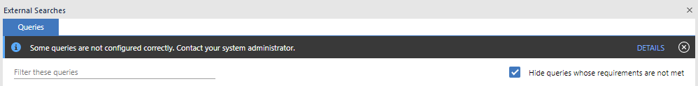

# Troubleshooting guide
This is a list of common issues you may face during the development of your
connector and how to solve them. They are categorized by the stage of
development in which they may arise.

If you come across a problem that is not covered below, please raise an issue
[here](https://github.com/IBM-i2/Analyze-Connect/issues).

## Where to check for errors
### Log files
The i2 Analyze server logs can be found in the
`i2analyze\deploy\wlp\usr\servers\opal-server\logs\` directory.
- `console.log` is the main server log file.
- `opal-services-daod\IBM_i2_Analysis_Repository.log` is where errors with your
  connector configuration and/or data will appear.

## Connector configuration errors
###  "Failed to retrieve configuration information for the connector with identifier '\<CONNECTOR_ID\>' from the URL '\<URL\>'"
You will see this in the output when running `setup -t start` if i2 Analyze fails to
retrieve your connector's configuration from its config endpoint. Check that
the base URL printed here is correct. If not, update the connector base url
given in the i2 Analyze `topology.xml` file (in the
`i2analyze\toolkit\configuration\environment` directory). If the URL is correct,
then you need to check the implementation of your config endpoint and that you
have assigned to it the correct URL path. This should be the base URL suffixed with
"/config".

### "Some queries are not configured correctly. Contact your system administrator.‬"



You will see this in the External Searches window if there is a problem with
your connector configuration. Clicking **DETAILS** will provide more information.
Problems might include:
- no `acquireUrl` defined for a service: make sure you define one in the service
  definition
- invalid default timezone: make sure you set a `timeZoneId` in the
  `defaultValues` section of your connector configuration
- The application is communicating with the connector through a protocol that is
  insecure. You will see this because i2 Analyze and your connector communicate
  via HTTP. In a production environment, you should secure this connection by
  using HTTPS. This is beyond the scope of this guide, but is covered in the
  Knowledge Centre
  [here](https://www.ibm.com/support/knowledgecenter/en/SSXVXZ_latest/com.ibm.i2.eia.go.live.doc/t_connect_security.html).

## Errors running connector services
### "Failed to open the selected query. Contact your system administrator"


If you see the above error message when trying to run a query defined by your
connector via External Searches in Analysts's Notebook Premium, there are a
number of potential causes. To understand what went wrong:
1. Look at the log file:
   ```
   i2analyze\deploy\wlp\usr\servers\opal-server\logs\opal-services-daod\IBM_i2_Analysis_Repository.log
   ```
2. You should see at the bottom a more detailed description of the error that occurred.
   You will most likely see an error message starting with the following:
    ```
    d484-4e04-97d5-86e771fed434  - Validation error while retrieving a record.
    - The service with identifier '<SERVICE_NAME>' on the connector with identifier '<CONNECTOR_ID>' returned invalid data
    ```
    Below this line will be more specific information about why the query failed.
    Examples and their solutions are given below.

#### "The schema does not contain an entity/a link/a property with identifier '\<TYPE_ID\>'"
This means you have supplied an entity or link with a `typeId` that does not
exist in your schema. Check that the `typeId` you supplied is not a typo.

#### "The value '\<PROPERTY_VALUE\>' is not valid for the property type with identifier '\<TYPE_ID\>'. The value '\<PROPERTY_VALUE\>' is incompatible with the '\<LOGICAL_TYPE\>' data type."
This means that the property value you supplied is not in the correct format,
which is defined by the logical type of the property. This is especially common
when dealing with `DATE`, `TIME` and `DATETIME` properties as it can
be finicky to ensuring input of such values is in the right format. 

Check that you have
assigned an appropriate logical type for this property and see the
[data model examples](./data-model.md) to understand the required format for
each logical type.
